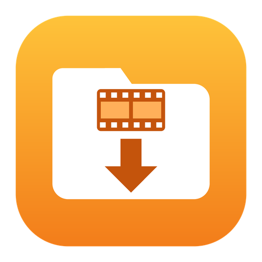
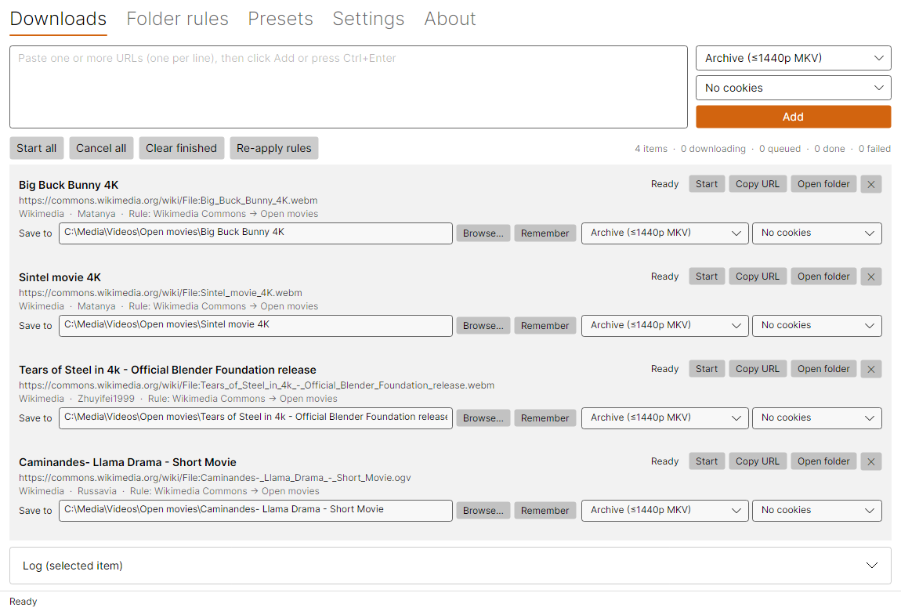
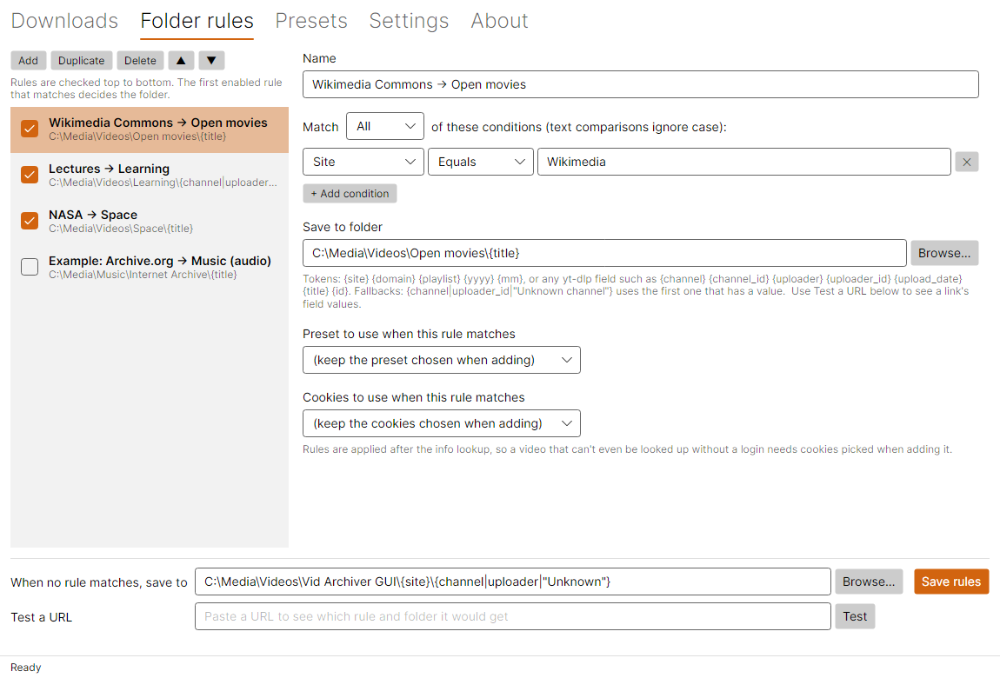
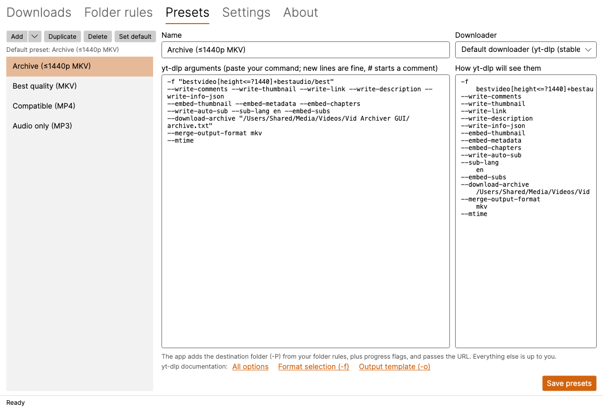
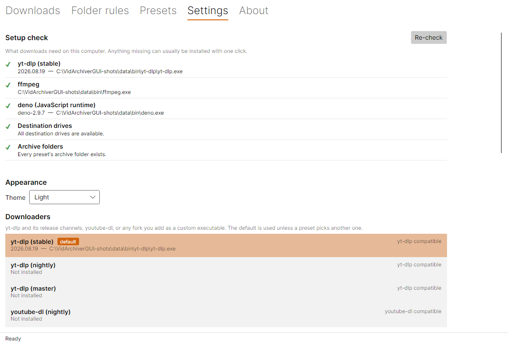
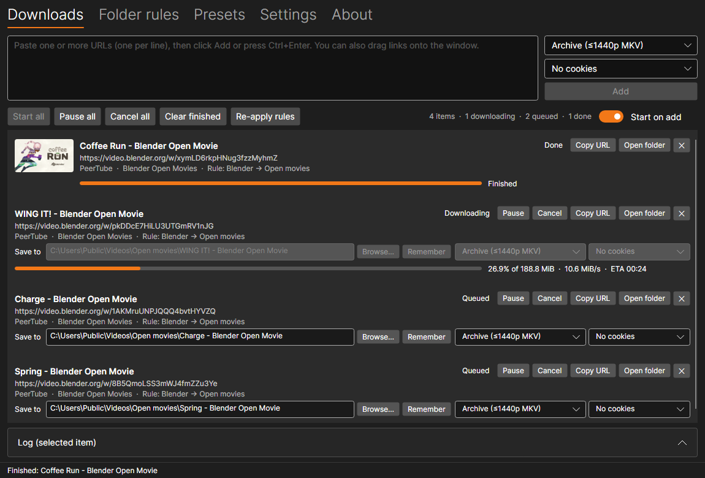

<p align="center"></p>

<h1 align="center">Vid Archiver GUI</h1>

<p align="center">
  <a href="https://github.com/disibio/vid-archiver-gui/releases">Download</a> ·
  <a href="https://disibio.github.io/vid-archiver-gui/">Website</a> ·
  <a href="#building">Build from source</a>
</p>

A desktop front end for [yt-dlp](https://github.com/yt-dlp/yt-dlp) for Windows, macOS and Linux. I built it because I
liked [yt-dlg (the oleksis fork)](https://github.com/oleksis/youtube-dl-gui) but kept running into small things that
annoyed me. The goal is to be dead simple to use.

The main thing it adds is folder rules. You tell it where videos from a site, channel or playlist should go, and
every download gets filed into the right folder automatically.

____



It's a from-scratch rewrite in C# (.NET 10 and Avalonia), not a fork, and it doesn't include any code from yt-dlg.
Most of the code was written with AI (Claude Opus 5.5), and I've tested it a lot.

## Download

Grab the latest build from [Releases](https://github.com/disibio/vid-archiver-gui/releases).

- **Windows:** a standalone `.exe` in a `.zip`. It isn't code-signed yet, so SmartScreen may complain the first time.
  Click **More info**, then **Run anyway**.
- **Linux:** `.tar.gz` packages for x64 and arm64. Unpack and run `./install.sh`.
- **macOS:** build it yourself for now (see [Building](#building)).

The first time you open it, the app offers to install yt-dlp, FFmpeg and deno for you.

## Screenshots

| Folder rules | Presets |
|---|---|
|  |  |
| **Settings** | **Dark theme** |
|  |  |

## How it works

1. Paste one or more links on the Downloads tab and click **Add** (or press Ctrl+Enter).
2. The app asks yt-dlp what the link is (`yt-dlp -J --flat-playlist`): which site, channel and playlist it belongs to.
3. It goes through your folder rules from top to bottom, and the first one that matches picks the folder (and the
   preset, if you set one). If nothing matches, it uses your fallback folder. You can still change the folder by hand.
4. Click **Start** or **Start all**. yt-dlp runs with your preset's options plus `-P <folder>`.

If you set a folder by hand, you can click **Remember** to turn it into a rule for that channel.

## Folder rules

A rule has one or more conditions, and you choose whether all of them or any of them need to match. You can match on:

| Field | Example |
|---|---|
| Site | `ArchiveOrg`, `Wikimedia` (the name yt-dlp uses for the site; its channels and playlists use the same name) |
| Domain | `archive.org`, `commons.wikimedia.org` |
| Channel | `My Favourite Creator` |
| ChannelId | the site's ID for the channel |
| Playlist | `Lo-fi Beats` |
| Title, Url | anything |

Each condition can be Equals, Contains, StartsWith or Regex. None of them care about upper or lower case.

Folder paths can include tokens that get filled in per video:

- `{site}`, `{domain}`, `{playlist}`, `{yyyy}` and `{mm}` are built in.
- You can also use any field from yt-dlp's info JSON by name, like `{channel}`, `{channel_id}`, `{uploader}`,
  `{uploader_id}`, `{upload_date}`, `{title}`, `{id}` or `{extractor_key}`.
- `{channel|channel_id|uploader}` uses the first one that has a value (`{(a|b)}` works too). Put text in quotes to
  use it as-is, e.g. `{playlist|"Singles"}`.
- If none of them have a value, the folder is called `Unknown`.

For example, `E:\ARCHIVE\{site}\{channel|channel_id|uploader|uploader_id}` gives each channel its own folder
under its site.

Not sure what a link will match? Use **Test a URL** on the rules tab to see its fields and which folder it would go to.

## Presets

A preset is a set of normal yt-dlp options ([full list](https://github.com/yt-dlp/yt-dlp#usage-and-options)), so you
can paste in the command you already use. Quotes group text, backslashes stay as they are (so Windows paths work),
you can split options over several lines, and lines starting with `#` are comments.

The app adds `-P`, `--ffmpeg-location`, `--newline` and a progress template itself. Everything else is up to you.
Login options like `--cookies-from-browser`, `--cookies` and `--proxy` are also used when looking up a link.

## When a download fails

The app looks at the error and handles it depending on what went wrong. This applies both when looking up a link
and when downloading it.

| Problem | What the app does |
|---|---|
| Network trouble (timeouts, dropped connections, 5xx server errors) | Tries again with the same downloader after 15 seconds, then after 60 |
| The site changed and yt-dlp can't read it ("Unable to extract", nsig/signature errors, missing formats) | Tries your other downloaders of the same type in order (e.g. stable, then nightly, then master, then your forks), installing them first if needed. Whichever one works is remembered for that video. You can turn this off in Settings > Downloaders. |
| Needs a login (bot check, age limit, members-only) | Stops and suggests picking cookies. It never adds cookies on its own. |
| Can't read the browser's cookies | Stops and suggests closing the browser, using Firefox, or using a cookies.txt |
| Rate-limited (429, "try again later") | Stops and suggests waiting and turning on Download gently |
| Video is gone (private, removed, blocked in your country, unsupported link) | Stops, since nothing else would help |

## Download gently

Turn this on in **Settings > Downloads**. Every download waits 1 second before each request and 5 to 15 seconds
between videos, and waits longer after each failed retry (up to a minute). It's slower, but sites are much less likely
to throttle you or start asking you to sign in. It's worth using when archiving a whole channel, ideally with only one
download running at a time. If a preset has its own `--sleep-*` or `--retry-sleep` options, those win.

## Cookies

Some videos need you to be logged in: members-only videos, age-restricted ones, or when a site wants you to prove
you're not a bot. Pick cookies from the **Cookies** list on the Downloads tab (for new links) or on a single video,
then start it again.

- The list has **No cookies** (the default), every browser found on your computer (Firefox, Chrome, Edge, Brave,
  Chromium, Vivaldi, Opera, Whale, Safari), and any cookies.txt files or browser profiles you add in
  **Settings > Cookies**.
- A folder rule can pick cookies too, so a members-only channel can always use Firefox, for example.
- Whatever you pick replaces any cookie options in the preset. If you pick **No cookies**, the preset's own options
  still apply.
- Firefox works best. On Windows, Chrome-based browsers usually can't be read while they're open, and newer versions
  encrypt their cookies, so export a cookies.txt instead. youtube-dl only supports cookies.txt files.
- Cookies link your downloads to your account, and heavy archiving with them can get that account rate-limited. Only
  use them where you need to.

## Downloaders

You can have several downloaders set up in Settings. One is the default, and each preset can use a different one.
That also means a folder rule can send a site through, say, the nightly build by picking a preset that uses it.

| Downloader | Where it comes from |
|---|---|
| yt-dlp (stable, nightly, master) | Installed and updated by the app from `yt-dlp/yt-dlp`, `yt-dlp-nightly-builds` and `yt-dlp-master-builds` |
| youtube-dl (nightly) | Installed and updated by the app from `ytdl-org/ytdl-nightly` |
| Custom | Any program you point it at (a fork, a pip install, etc.), marked *yt-dlp compatible* or *youtube-dl compatible* |

The default downloader is installed the first time you run the app, and the ones the app installed are checked for
updates once a day. youtube-dl-style downloaders get their folder through `-o` instead of `-P` (a relative `-o` in the
preset ends up inside the chosen folder), and progress is read from their normal output. Options aren't the same between downloaders, so write each preset for the
one it uses.

When the app updates a downloader, it keeps the old version. If a new release breaks something, select it and click
**Roll back to...**. The daily check then skips that release until a newer one comes out. **Check for update**
installs it anyway, and clicking **Roll back** again undoes the rollback.

Every download shows the link it came from. Use **Copy URL**, or right-click to copy the link, title or folder, or
to add it again.

## First-run setup

The **Setup check** at the top of the Settings tab runs `yt-dlp -v` to see what's actually available, and checks
your folders. If something is missing you'll see a banner, and **Fix now** installs it. Everything the app installs
goes into its own data folder and is checked against the publisher's SHA-256 checksums.

| What | Why it's needed | Windows | macOS | Linux |
|---|---|---|---|---|
| yt-dlp | Does the downloading | Automatic | Automatic | Automatic |
| deno | Some sites need it to get past JavaScript checks (only yt-dlp uses it by default) | One click | One click | One click |
| FFmpeg | Merging video and audio, and embedding things into files | One click | `brew install ffmpeg` (with a Copy button) | One click (needs `tar`), or the apt/dnf/pacman/zypper command |
| Archive folder | `--download-archive` needs the folder to exist | Create folder | Create folder | Create folder |

If you've already installed any of these yourself (on your PATH, through Homebrew, or in `~/.local/bin`), the app
uses those.

## Supported systems

Windows 10 and 11, macOS 14 or newer (Apple Silicon and Intel), and 64-bit Linux (x64 or arm64, glibc). These come
from what .NET 10 supports. I've tested Linux on Ubuntu 22.04 under WSLg, including setup and a full download.
I haven't been able to test on a real Mac yet.

Settings are stored in:

- Windows: `%APPDATA%\VidArchiverGui\settings.json`
- macOS: `~/Library/Application Support/VidArchiverGui`
- Linux: `~/.config/VidArchiverGui`

The Microsoft Store version keeps them in its own package folder (Settings > App data shows where). To make it
portable, put an empty file called `portable.txt` next to the program and it'll keep its data there instead.

## Building

```
dotnet build VidArchiverGui.slnx
dotnet test
dotnet run --project src/VidArchiverGui.App
```

The packaged builds are self-contained, so people don't need .NET installed.

| Target | Command | Output |
|---|---|---|
| Windows | `run.bat publish` | `publish/win-x64/VidArchiverGui.exe` plus license files |
| Linux | `packaging/package-linux.sh` (on Linux, or in WSL using the Windows `dotnet.exe`) | `publish/linux/*.tar.gz` for x64 and arm64. Unpack and run `./install.sh` to add a menu entry, or `./install.sh --remove` to uninstall. |
| Microsoft Store | `powershell -ExecutionPolicy Bypass -File packaging\package-msix.ps1` (needs the Windows SDK; fill in `packaging/msix/store-identity.json` from Partner Center first, and add `-Sign` for a local test install) | `publish/msix/*.msixbundle` for x64 and arm64. Listing text is in `packaging/msix/store-listing.md`. |
| macOS | `packaging/package-macos.sh`, run on a Mac (Apple Silicon needs the ad-hoc signature it applies) | `publish/macos/*.zip` with `Vid Archiver GUI.app` for arm64 and x64 |

The macOS app isn't notarized, so the first time you open it, right-click it and choose **Open**.

### Project layout

- `src/VidArchiverGui.Core`: all the logic with no UI. Models, the rules engine, path tokens, argument parsing,
  running yt-dlp and reading its output, and installing and updating tools.
- `src/VidArchiverGui.App`: the Avalonia UI (MVVM with CommunityToolkit.Mvvm).
- `tests/VidArchiverGui.Core.Tests`: unit tests for Core.

### Screenshot mode

Debug builds can render every tab to PNG files without opening a window and then exit, which is handy for checking UI changes. Set
`VIDARCHIVERGUI_SNAPSHOT_DIR=<folder>`, and optionally `VIDARCHIVERGUI_SNAPSHOT_URLS=url1;url2` to add some links first.

To simulate a first run, also set `VIDARCHIVERGUI_SNAPSHOT_SETUP=1` (with a `portable.txt` next to the app so it
starts with a clean data folder). It captures the setup banner and presses **Fix now**. Add
`VIDARCHIVERGUI_SNAPSHOT_DOWNLOAD=<url>` (and optionally `VIDARCHIVERGUI_SNAPSHOT_PRESET=<name prefix>`) to do a
real download too.

## License

Apache License 2.0. See [LICENSE](LICENSE) and [NOTICE](NOTICE). Copyright 2026 The Vid Archiver GUI contributors.

Third-party components and their licenses are listed in [THIRD-PARTY-NOTICES.txt](THIRD-PARTY-NOTICES.txt) and on
the app's About tab. yt-dlp, youtube-dl and FFmpeg aren't bundled with the app. It downloads them from their official
releases, checks them against the published checksums, and they stay under their own licenses. If the dependencies
change, regenerate THIRD-PARTY-NOTICES.txt from the packages' license files.
